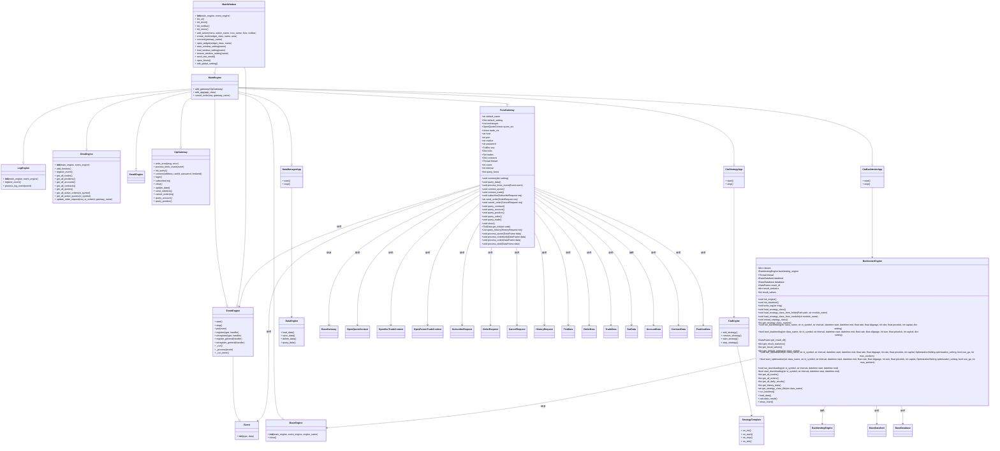

> Warning: This page is translated by MACHINE, which may lead to POOR QUALITY or INCORRECT INFORMATION, please read with CAUTION!

```mermaid
classDiagram
    class Event {
        + __init__(type, data)
    }

    class EventEngine {
        + start()
        + stop() 
        + put(event) 
        + register(type, handler)
        + unregister(type, handler)
        + register_general(handler) 
        + unregister_general(handler) 
        + _run()
        + _process(event)
        + _run_timer()
    }

    class MainEngine {
        + add_gateway(CtpGateway)
        + add_app(app_class)
        + cancel_order(req, gateway_name)
    }

    class BaseEngine {
        + __init__(main_engine, event_engine, engine_name)
        + close()
    }

    class LogEngine {
        + __init__(main_engine, event_engine)
        + register_event()
        + process_log_event(event)
    }

    class OmsEngine {
        + __init__(main_engine, event_engine)
        + add_function()
        + register_event()
        + get_all_trades()
        + get_all_positions()
        + get_all_accounts()
        + get_all_contracts()
        + get_all_quotes()
        + get_all_active_orders(vt_symbol)
        + get_all_active_quotes(vt_symbol)
        + update_order_request(req, vt_orderid, gateway_name)
    }

    class EmailEngine {
    }

    class CtpGateway {
        + write_error(msg, error)
        + process_timer_event(event)
        + init_query()
        + connect(address, userid, password, brokerid)
        + login()
        + subscribe(req)
        + close()
        + update_date()
        + send_order(req)
        + cancel_order(req)
        + query_account()
        + query_position()
    }
    class BacktesterEngine {
        +dict classes
        +BacktestingEngine backtesting_engine
        +Thread thread
        +BaseDatafeed datafeed
        +BaseDatabase database
        +DataFrame result_df
        +dict result_statistics
        +list result_values
        +void init_engine()
        +void init_datafeed()
        +void write_log(str msg)
        +void load_strategy_class()
        +void load_strategy_class_from_folder(Path path, str module_name)
        +void load_strategy_class_from_module(str module_name)
        +void reload_strategy_class()
        +list get_strategy_class_names()
        +void run_backtesting(str class_name, str vt_symbol, str interval, datetime start, datetime end, float rate, float slippage, int size, float pricetick, int capital, dict setting)
        +bool start_backtesting(str class_name, str vt_symbol, str interval, datetime start, datetime end, float rate, float slippage, int size, float pricetick, int capital, dict setting)
        +DataFrame get_result_df()
        +dict get_result_statistics()
        +list get_result_values()
        +dict get_default_setting(str class_name)
        +void run_optimization(str class_name, str vt_symbol, str interval, datetime start, datetime end, float rate, float slippage, int size, float pricetick, int capital, OptimizationSetting optimization_setting, bool use_ga, int max_workers)
        +bool start_optimization(str class_name, str vt_symbol, str interval, datetime start, datetime end, float rate, float slippage, int size, float pricetick, int capital, OptimizationSetting optimization_setting, bool use_ga, int max_workers)
        +void run_downloading(str vt_symbol, str interval, datetime start, datetime end)
        +bool start_downloading(str vt_symbol, str interval, datetime start, datetime end)
        +list get_all_trades()
        +list get_all_orders()
        +list get_all_daily_results()
        +list get_history_data()
        +str get_strategy_class_file(str class_name)
    }
    class FutuGateway {
        +str default_name
        +Dict default_setting
        +List exchanges
        +OpenQuoteContext quote_ctx
        +Union trade_ctx
        +str host
        +int port
        +str market
        +str password
        +TrdEnv env
        +Dict ticks
        +Set trades
        +Dict contracts
        +Thread thread
        +int count
        +int interval
        +list query_funcs
        +void connect(dict setting)
        +void query_data()
        +void process_timer_event(Event event)
        +void connect_quote()
        +void connect_trade()
        +void subscribe(SubscribeRequest req)
        +str send_order(OrderRequest req)
        +void cancel_order(CancelRequest req)
        +void query_contract()
        +void query_account()
        +void query_position()
        +void query_order()
        +void query_trade()
        +void close()
        +TickData get_tick(str code)
        +List query_history(HistoryRequest req)
        +void process_quote(DataFrame data)
        +void process_orderbook(DataFrame data)
        +void process_order(DataFrame data)
        +void process_deal(DataFrame data)
    }

    
    class MainWindow {
        + __init__(main_engine, event_engine)
        + init_ui()
        + init_dock()
        + init_toolbar()
        + init_menu()
        + add_action(menu, action_name, icon_name, func, toolbar)
        + create_dock(widget_class, name, area)
        + connect(gateway_name)
        + open_widget(widget_class, name)
        + save_window_setting(name)
        + load_window_setting(name)
        + restore_window_setting(name)
        + send_test_email()
        + open_forum()
        + edit_global_setting()
    }

    class CtaStrategyApp {
        + start()
        + stop()
    }

    class CtaEngine {
        + add_strategy()
        + remove_strategy()
        + start_strategy()
        + stop_strategy()
    }

    class StrategyTemplate {
        + on_init()
        + on_start()
        + on_stop()
        + on_tick()
    }

    class CtaBacktesterApp {
        + start()
        + stop()
    }

    class BacktesterEngine {
        + run_backtest()
        + load_data()
        + calculate_result()
        + show_chart()
    }

    class DataManagerApp {
        + start()
        + stop()
    }

    class DataEngine {
        + load_data()
        + save_data()
        + delete_data()
        + query_data()
    }

    EventEngine --|> Event
    MainEngine --|> EventEngine
    MainEngine --|> BaseEngine
    MainEngine --|> LogEngine
    MainEngine --|> OmsEngine
    MainEngine --|> EmailEngine
    MainEngine --|> CtpGateway
    MainEngine --|> FutuGateway
    MainEngine --|> CtaStrategyApp
    MainEngine --|> CtaBacktesterApp
    MainEngine --|> DataManagerApp
    MainWindow --|> MainEngine
    MainWindow --|> EventEngine
    CtaStrategyApp --> CtaEngine
    CtaEngine --> StrategyTemplate
    CtaBacktesterApp --> BacktesterEngine
    DataManagerApp --> DataEngine
    BacktesterEngine --> BaseEngine : 继承
    FutuGateway --> BaseGateway : 继承
    BacktesterEngine --> BacktestingEngine : 使用
    BacktesterEngine --> BaseDatafeed : 使用
    BacktesterEngine --> BaseDatabase : 使用
    FutuGateway --> OpenQuoteContext : 使用
    FutuGateway --> OpenSecTradeContext : 使用
    FutuGateway --> OpenFutureTradeContext : 使用
    FutuGateway --> EventEngine : 使用
    FutuGateway --> SubscribeRequest : 使用
    FutuGateway --> OrderRequest : 使用
    FutuGateway --> CancelRequest : 使用
    FutuGateway --> HistoryRequest : 使用
    FutuGateway --> TickData : 使用
    FutuGateway --> OrderData : 使用
    FutuGateway --> TradeData : 使用
    FutuGateway --> BarData : 使用
    FutuGateway --> AccountData : 使用
    FutuGateway --> ContractData : 使用
    FutuGateway --> PositionData : 使用
    FutuGateway --> Event : 使用

```